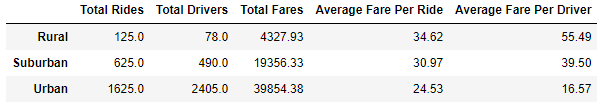

# PyBer_Analysis

## **Overview of the Analysis
	
	The purpose of this analysis is to create a summary DataFrame of the ride-sharing data by city the different city types, rural, suburban, and urban. Then a multiple line graph is created to show the total weekly fares for each city type.

## **Results** 

	Looking at the results, there are some key differences to consider when comparing the ride-sharing data 	between the different city types. 

	1.) Urban cities have the highest demand, the number of total rides is 1,625, then suburban cities with 625, 	and lastly rural cities have the least 625 total rides.  

	2.) The number of  total drivers in urban cities which is 2405, exceeds the number of rides.

	3.) While urban cities have the highest number of total fares, the average fare per ride is highest in rural 	cities, with the an average of $34.62 per ride. 

	4.) Rural cities also have the highest average fare per driver with an average of $55.49. 

## Summary 

	After reviewing the Pyber summary DataFrame and the Pyber__fare_Summary chart, there is potential for 	increasing revenue in several areas for each city.

	1.) Looking at the Pyber_fare_Summary chartrural cities are consistent with the number of rides throughout 	the year, there is a small increase towards the end of February and then again in February. However, rural 	cities could benefit from increasing the number of drivers, considering that rural cities have the highest 		fare rate, the consumer could benefit from having more drivers available when they are needed and PyBer 	could benefit from the average fare per ride. 
	
	2.) Suburban cities could also benefit from additional drivers particularly during peak times in the 			year, the PyBer_fare_Summary shows there is a peak at the end of February and then again in mid April.
	
	3.) Urban cities could benefit from reducing the number drivers. Since there are more drivers than 		        total rides, the need for ridesharing is being met. 

	

	

	
	

